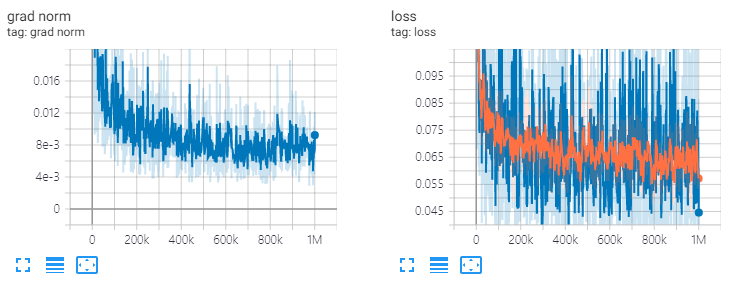

# tf-diffwave
(Unofficial) Tensorflow implementation of DiffWave (Zhifeng Kong et al., 2020)

- DiffWave: A Versatile Diffusion Model for Audio Synthesis, Zhifeng Kong et al., 2020. [[arXiv:2009.09761](https://arxiv.org/abs/2009.09761)]

## Requirements

Tested in python 3.7.3 conda environment, [requirements.txt](./requirements.txt)

## Usage

For downloading LJ-Speech dataset, in python prompt, run under commands.

Dataset will be downloaded in '~/tensorflow_datasets' in tfrecord format. If you want to change the download directory, specify `data_dir` parameter of LJSpeech initializer.

```python
from dataset import LJSpeech
from dataset.config import Config

config = Config()
# lj = LJSpeech(config, data_dir=path, download=True)
lj = LJSpeech(config, download=True) 
```

To train model, run [train.py](./train.py). 

Checkpoint will be written on `TrainConfig.ckpt`, tensorboard summary on `TrainConfig.log`.

```bash
python train.py
tensorboard --logdir ./log/
```

If you want to train model from raw audio, specify audio directory and turn on the flag `--from-raw`.

```bash
python .\train.py --data-dir D:\LJSpeech-1.1\wavs --from-raw
```

To start to train from previous checkpoint, `--load-step` is available.

```bash
python .\train.py --load-step 416 --config ./ckpt/q1.json
```

For experiments of errors, reference [expr.ipynb](./expr.ipynb).

## Learning Curve

res.channels=64, T=20, train 500k steps.



## Samples

Comming soon
